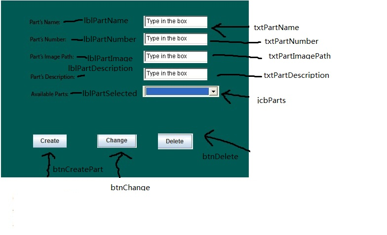
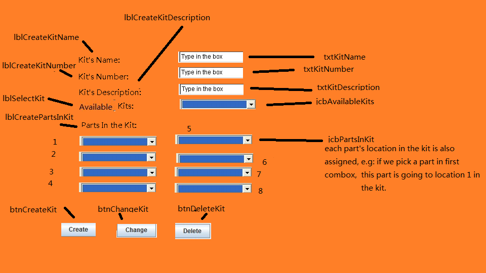
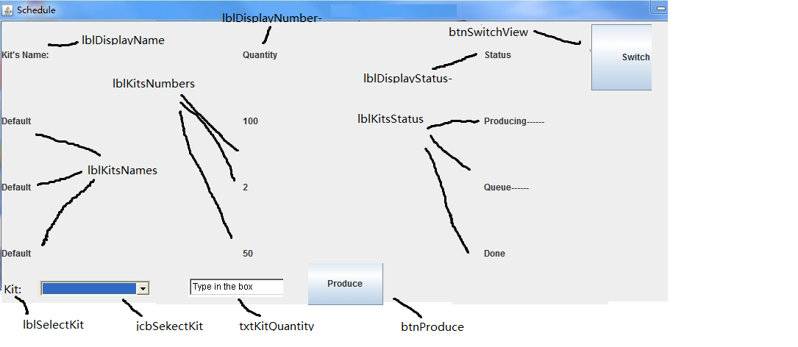
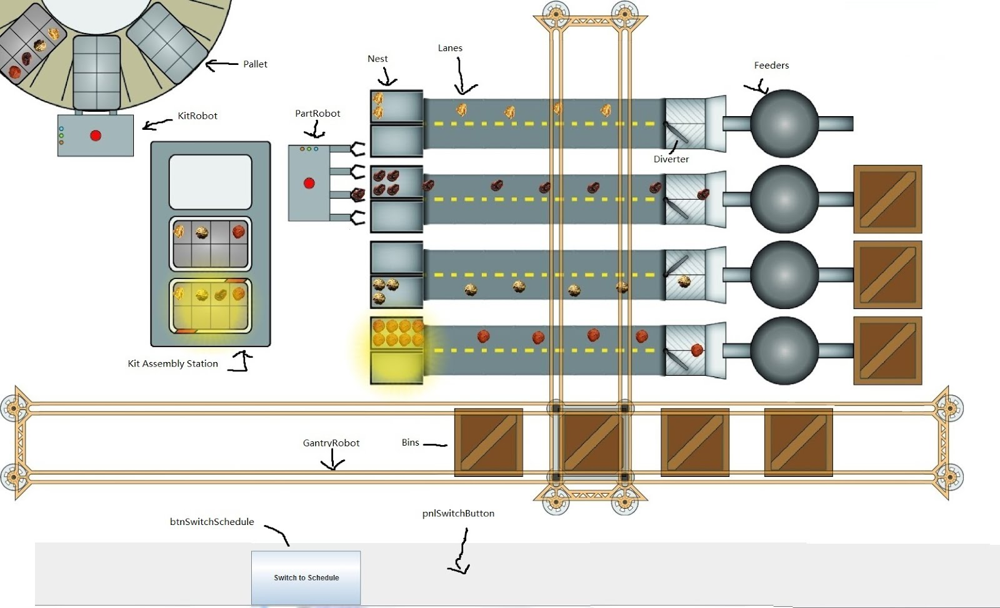
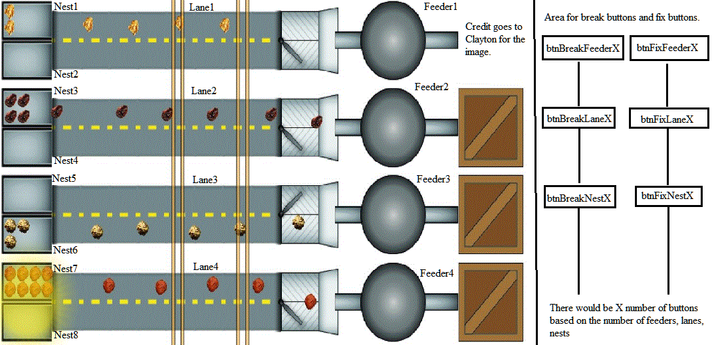
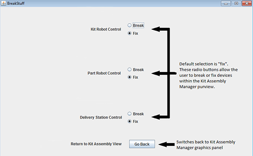

## Server
          class implementing a non-GUI server application to coordinate factory clients over a network

***

* Member Constants (all public and static):
     * Port - networking port that server listens on
     * SettingsPath - path of file where factory state is saved
* Member Data (all private):
      * serverSocket - server socket used to set up connections with clients
      * netComms - ArrayList of client connections
      * wantsFactoryState - ArrayList of booleans indicating whether each client wants to be updated with the factory state
      * partTypes - ArrayList of Parts that are available to produce
      * kitTypes - ArrayList of Kits that are available to produce
      * produceStatus - ProduceStatusMsg storing current kit production status
      * factoryState - FactoryStateMsg storing current factory state
      * factoryUpdate - FactoryUpdateMsg storing changes to broadcast to clients on next timer tick
* Methods:
      * Server - constructor for server class
      * main - instantiates a new Server
      * actionPerformed - called during timer tick; updates simulation and broadcasts factoryUpdate to clients
      * msgReceived - handle message received from clients (takes message and NetComm that received the message); generally calls another method to handle the specific message
      * addPart - takes an AddPartMsg and client index, adds part to partTypes (if valid), sends StringMsg to client indicating success or failure
      * changePart - takes a ChangePartMsg and client index, changes specified part (if valid and not in production), sends StringMsg to client indicating success or failure
      * deletePart - takes a DeletePartMsg and client index, deletes part with specified name (if exists), sends StringMsg to client indicating success or failure
      * listParts - takes client index and sends partTypes to client in a PartListMsg (called when server receives a PartListMsg, but received message is not a parameter because it doesn’t influence behavior of the method)
      * addKit - takes an AddKitMsg and client index, adds kit to kitTypes (if valid), sends StringMsg to client indicating success or failure
      * changeKit - takes a ChangeKitMsg and client index, changes specified kit (if valid and not in production), sends StringMsg to client indicating success or failure
      * deleteKit - takes a DeleteKitMsg and client index, deletes kit with specified name (if exists), sends StringMsg to client indicating success or failure
      * listKits - takes client index and sends kitTypes to client in a KitListMsg (called when server receives a KitListMsg, but received message is not a parameter because it doesn’t influence behavior of the method)
      * produceKits - takes a ProduceKitsMsg and client index and appends it to produceStatus (if valid) indicating that it is queued, sends StringMsg to client indicating success or failure
      * sendProduceStatus - takes client index and sends produceStatus to client (called when server receives a ProduceStatusMsg)
      * sendFactoryState - takes client index, sets wantsFactoryState to true for this client, and sends current factoryState to client (called when server receives a FactoryStateMsg)
      * changeNormative - takes a NonNormativeMsg and client index, breaks or fixes specified item, sends StringMsg to client indicating success or failure
      * loadSettings - load factory state from file
      * saveSettings - save factory state to file

***

## Part Manager

### PartsClient
          This class contains the main method and communicates with the server.
* Member Data:
      * private CardLayout layout - use the cardlayout to switch screen between connectpanel and mPanel
      * private ConnectPanel cPanel - allow the client to connect to server
      * private PartManager mPanel - the panel to display part manager
      * netComm - NetComm instance to communicate with server
* Methods:
      * msgReceived - handles message from server (takes message and
NetComm that received the message)
      * actionPerformed() - handles the input, send any modification of the parts to server
### PartManager (extends JPanel) : 
* Constructor: PartManager( PartsClient pc ) - uses the GridBagLayout to line up the GUI components          
* Member Data:                
      * private PartsClient myClient - fetch data from the client
      * private JLabel pName - prompt user the part name
      * private JLabel pNumber - prompt user the part number
      * private JLabel pInfo - prompt user the part description
      * private JLabel pEdit - prompt user the number of which part he wants to change/delete
      * private JTextField tName - textfield to enter the part name
      * private JTextField tNumber - textfield to enter the part number
      * private JTextField tInfo - textfield to enter the part description
      * private JTextField tEdit - textfield to enter the number of which part he wants to change/delete
      * private JButton create - button to create a kit
      * private JButton change - button to change a kit
      * private JButton delete - button to delete a kit
      * private JScrollPane scroll - to display a list of available parts can be changed, deleted (in case the parts are too many)
      * private JPanel parts - a list of available parts can be changed, deleted
      * private JLabel msg - display helpful info
                      
* Methods:
      * actionPerformed() - handle the input, send any modification of the parts to server

***

## Kit Manager

### KitClient:
          This class contains the main method and communicates with the server.
* Member Data:
      * parts- ArrayList of all the parts
      * kits - ArrayList of all the kits
      * netComm- socket class to communicate with server
      * pnlConnect - ConnectPanel to let user connect to server
      * pnlKit- KitPanel for prompting user input
* Methods:
      * getKitDescription() – get the description of the kit
      * geKitNumber() – get the number of the kit                                                                        * getKitName() – get the name of the kit
      * getPartsInKit() - get the arraylist of parts in the kit                                                          
      * msgReceived - handles message from server (takes message and NetComm that received the message)
      * actionPerformed - receives action events from pnlConnect
### KitPanel
          user can create a new kit, or order a existing kit.
* Member Data:
      * lblCreateKitNumber - Label for prompting user the number of the new kit
      * lblCreateKitDescription - Label for kit Desc                                                   
      * lblCreateKitName - Label for kit name
      * lblCreatePartsInKit - Label for parts in a kit
      * lblSelectKit - Label for prompting user the name of  a kit he wants to change or delete
      * btnDeleteKit - button for deleting a kit                                                                             * btnCreateKit- button for Creating a new kit
      * btnChangeKit - button for changing a selected kit
      * jcbPartsInKit - ArrayList of ComboBox for selecting parts in a kit when 
creating or modifing a kit. (some of them can be empty, but parts in a kit at most can be 8)
      * txtKitNumber - TextField for kit number
      * txtKitDescription - TextField for kit description
      * txtKitName - TextField for kit name
      * jcbAvailableKits - ComboBox for the avaiable kits
* Methods:
      * actionPerformed() - handle the input, send any modification of the kits to         
server

***

## Factory Production Manager

GUI View of Factory (most of the labeled items are contained in the factoryState variable)

### FPClient
          This class contains the main method and communicates with the server.
* Member Data:
      * pnlConnect - ConnectPanel to let user connect to server
      * factoryState - FactoryStateMsg that is kept in sync with the server copy
      * netComm- socket class to communicate with server, need to update the
      * parts and kits
      * pnlFPPanel - JPanel for showing the schedule
      * pnlFactory - JPanel to display the factory state in (contains pnlSwitchButton and pnlFactoryPaint)
      * pnlSwitchButton - JPanel for switch button (this panel only contains btnSwitchSchedule)
      * pnlFactoryPaint - JPanel drawn inside pnlFactory
      * jcbSelectKit - Combobox for displaying what kits can be make
      * txtKitQuantity - JTextField for enter kit’s quantity
      * lblSelectKit - JLabel for user to select a kit
      * lblDisplayName - JLabel for display name
      * lblDisplayNumber- JLabel for display number
      * lblDisplayStatus- JLabel for display status
      * lblKitsNames - arraylist of kit’s label
      * lblKitsNumbers - arraylist of label of kits’ quantity
      * lblKitsStatus - arraylist of label of kits’ status
      * btnSwitchView - switch button for displaying the graphical view of factory
      * btnSwitchSchedule - switch button for displaying the schedule
      * btnProduce - Button for producing the kits
      * schedule<string kit’s name, int quantity> - TreeMap schedule to classify kits and their quantity
* Methods:
      * DeleteProducedKits(ArrayList <Kit> kits) – take the arraylist of the
available kits, check their status, if it is produced or in process, remove it from the arraylist.
      * writeSchdule() - Classlify the kits and write them into the labels on the
pnlFPPanel
      * msgReceived - handles message from server (takes message and
      * NetComm that received the message)
      * actionPerformed - handle the input, send any modification of the kits to
server, paint updated factory on timer tick if pnlFactory is showing

***

## Lane Manager:

### LaneClient
          This class shows all the feeder, lanes, nests operating.
* Member Data:
      * Lanes - ArrayList of 4 WholeLanes.
      * pnlBreakThings - Panel for breaking things
      * pnlConnect - ConnectPanel to let user connect to server
      * netComm- NetComm instance to communicate with the server
      * factoryState - FactoryStateMsg that is kept in sync with the server copy
* Methods:
      * takePictureOfLaneNests - takes a picture of specified lane’s nests if possible (lane index passed as parameter)
      * getPartFromNest - gets a part from specified nest (nest index passed as parameter)
      * feedFeeder - fill specified feeder (feeder index passed as parameter)
      * divertFeeder - switches the position of specified feeder’s diverter (feeder index passed as parameter)
      * fixLane - attempts to fix specified lane by increasing vibration (lane index passed as parameter)
                        paintWholeLanes() - paints all feeders, lanes, nests, parts
      * actionPerformed - receives action events from pnlConnect
      * msgReceived - handles message from server (takes message and NetComm that received the message)
        Mockup of the client:

***

### BreakThings
          Panel with options for breaking parts of the lanes
* Member Data:
      * btnBreakFeeder - ArrayList of 4 buttons that prevents the corresponding feeder from working
      * btnBreakLane - ArrayList of 4 buttons that causes the corresponding lane to stop
      * btnBreakNest - ArrayList of 8 buttons that causes the corresponding nest to spill
      * btnFixFeeder - ArrayList of 4 buttons that fix corresponding feeder
      * btnFixLane - ArrayList of 4 buttons that fix corresponding lane
      * btnFixNest - ArrayList of 8 buttons that fix corresponding nest
* Methods:
      * actionListener - sends status of feeders, lanes, nests to server

***

## Kit Assembly Manager

### KitAssemblyClient
          This class contains the main method and communicates with the server.
* Member Data:
      * queuedKits - ArrayList of currently queued kits
      * kitStandKits - ArrayList of kits on kitting stand (index 0-1 for assembly, 2
for inspection station).
      * netComm ( socket ) - instance of NetComm class for communication
with the server.
      * factoryState - FactoryStateMsg that is kept in sync with the server copy
      * kitCamera - instance of KitCamera
      * kitRobot - instance of a kit robot
      * partRobot - instance of a part robot
      * pnlConnect - declaration of ConnectPanel for connecting to server
      * pnlKitAssembly - JPanel to add the kitAssemblyGraphicsPanel and
      * pnlSwitchPanelButton to
      * pnlSwitchPanelButton - JPanel for a button to switch to the non-
      * normative controls panel (contained inside pnlKitAssembly)
      * kitAssemblyGraphicsPanel - declaration of instance of
      * KitAssemblyGraphicsPanel (contained inside pnlKitAssembly)
      * kitAssemblyBreakPanel - declaration of instance of
      * KitAssemblyBreakPanel
* Methods:
      * sendKitRobotTask( startStation, endStation, time )  - sends task to kit
robot.
      * sendPartRobotTask( nestNumber, kitStation, time ) - sends task to part
robot.
      * getKitRobotPos - returns position of kit robot
      * getPartRobotPos - returns position of part robot
      * removeKitFromQueue - removes kit from queuedKits
      * removeKitFromKitStand - removes kit from kit stand
      * actionPerformed - receives action events from pnlConnect
      * msgReceived - handles message from server (takes message and NetComm that received the message)

Kit Assembly Panel (pnlKitAssembly) mock-up:

***

### KitAssemblyGraphicsPanel
          This class is a JPanel that displays the kitting stand, the kit robot, the kit delivery station, and the part robot.
* Member Data:
* Methods:
      * paintKitAssemblyPanel - paints background images and instructs objects
        to repaint themselves.
      * takePicture - takes a picture

***

### KitAssemblyBreakPanel
           This class allows the user to break the kit robot, part robot, and kit delivery station
* Member Data:
      * lblKitRobot - JLabel for kit robot
      * lblPartRobot - JLabel for part robot
      * lblKitDelivery - JLabel for kit delivery station
      * radioBreakKitRobot - JRadioButton to break the kit robot
      * radioFixKitRobot - JRadioButton to fix the kit robot
      * radioBreakPartRobot - JRadioButton to break the part robot
      * radioFixPartRobot - JRadioButton to fix the part robot
      * radioBreakKitDelivery - JRadioButton to break the kit delivery station
      * radioFixKitDelivery - JRadioButton to fix the kit delivery station
Methods:
      * actionListener - send message to server via netComm updating the
status of the kit robot, part robot, or kit delivery station.

KitAssemblyBreakPanel mock-up:

***

## Gantry Robot Manager

### GantryClient
           This class contains the main method and communicates with the server.
* Member Data:
      * netComm- NetComm instance to communicate with server
      * pnlConnect - ConnectPanel to let user connect to server
      * factoryState - FactoryStateMsg that is kept in sync with the server copy
      * pnlGantry - instance of GantryPanel contained implementing a
 GridBagLayout manager consisting of pnlGantryNorm and
 pnlGantryNonNorm
* Methods:
      * sendGantryTask( startStation, endStation, time )  - sends task to gantry        
      * getGantryPos - returns position of gantry
      * getBinPos - returns position of bin
      * updateInfo - notifies server of any and all changes to bins and gantry
                        actionPerformed - receives action events from pnlConnect
      * msgReceived - handles message from server (takes message and NetComm that received the message)
                        
### GantryPanel
           This class is a container panel consisting 3 subpanels. Elements are arranged
using GridBagLayout. It displays a wide view of the gantry robot.
* Member Data:
      * pnlGantryNorm- instance of GantryNormPanel: normative panel displaying
inset of gantry
      * pnlGantryNonNorm- instance of GantryBreakPanel nonnormative break
panel displaying inset of gantry
      * gb- layout variable (type: GridBagLayout)
### GantryNormPanel
           This class consists of a normative view of all elements. It will respond to user
interaction from the GantryBreakPanel class.
* Member Data:
      * bins- ArrayList of bins on the floor
      * gantry - gantry robot
      * binLocations - ArrayList of all possible locations of bins
      * originalLocations - ArrayList of bins’ original location before being moved
around  (subset of binLocations)
      * purgeLocations - arraylist of purge stations (subset of binLocations)
      * tempLocations - arraylist of temporary locations (subset of binLocations)
* Methods:
      * paintGantryPanel - paints background images and instructs objects to
repaint themselves.
      * takePicture - takes a picture
### GantryBreakPanel
           This class allows the user to break the gantry
* Member Data:
      * lblGantry- JLabel for gantry
      * radioBreakGantry - JRadioButton to break the kit robot
      * lblBreakGantry - accompanying label for radioBreakGantry
      * radioFixGantry - JRadioButton to fix the gantry
      * lblFixGantry - accompanying label for radioFixGantry
* Methods:
      * actionListener - send message to server via netComm updating the
status of the gantry

Gantry Mockup image:

***